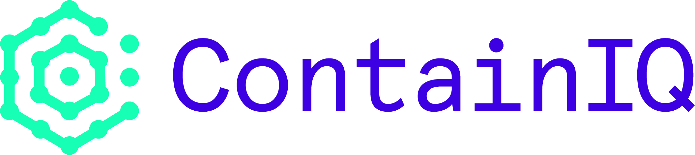

# ContainIQ




## How to install
### Install the metrics server
Check if it's already installed 

```kubectl get pods --all-namespaces | grep metrics-server```

If nothing is returned, install it with the command below 

```
git clone https://github.com/kubernetes-sigs/metrics-server.git
cd metrics-server
kubectl apply -f deploy/kubernetes/
```
#### Install the agent 

### Using kubectl 
Download the deployment file \
 `curl -L -o deployment.yaml https://raw.githubusercontent.com/containiq/containiq-deployment/master/deployment.yaml`

The `deployment.yaml` file contains all the necessary resources to run 
the ContainIQ agent in your cluster. 

First Add your api key to the secret object on line 19 of the `deployment.yaml` file. Next At the bottom of the file in the configmap replace "default" with a name of your choice. 
This is later used when filtering by cluster on our backend and allows you to differentiate between your clusters. 
  
Finally run `kubectl apply -f deployment.yaml `

### Using Helm
```
helm repo add containiq https://containiq.github.io/charts/ 
helm repo update
```

#### Helm 2
##### Note: replace the "default" text in clusterName with a name of your choice. This allows you to filter and differentiate your clusters in our backend.
```
helm install containiq containiq/containiq --namespace=containiq \
 --set comm.Key=<CONTAINIQ_API_KEY> \
 --set logs.enabled=true --set latency.enabled=true \
 --set clusterName=default
 ```

#### Helm 3
##### Note: replace the "default" text in clusterName with a name of your choice. This allows you to filter and differentiate your clusters in our backend.
 ```
helm install containiq containiq/containiq --namespace=containiq \
--create-namespace \
--set comm.Key=<CONTAINIQ_API_KEY> \
--set logs.enabled=true --set latency.enabled=true \
--set clusterName=default
```


## Setting up notifications

### Integrating with slack 
Click [here](https://app.containiq.com/profile/integration) to add your slack workspace and channel for notifications. 

### Creating Monitors
Click [here](https://app.containiq.com/profile/monitors) to create monitors for your kubernetes events and metrics. 
 
